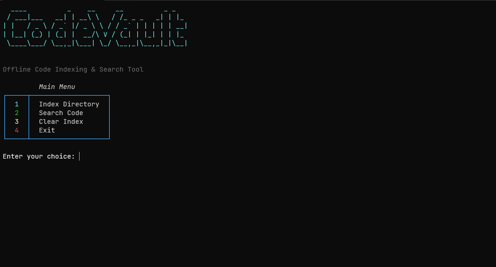
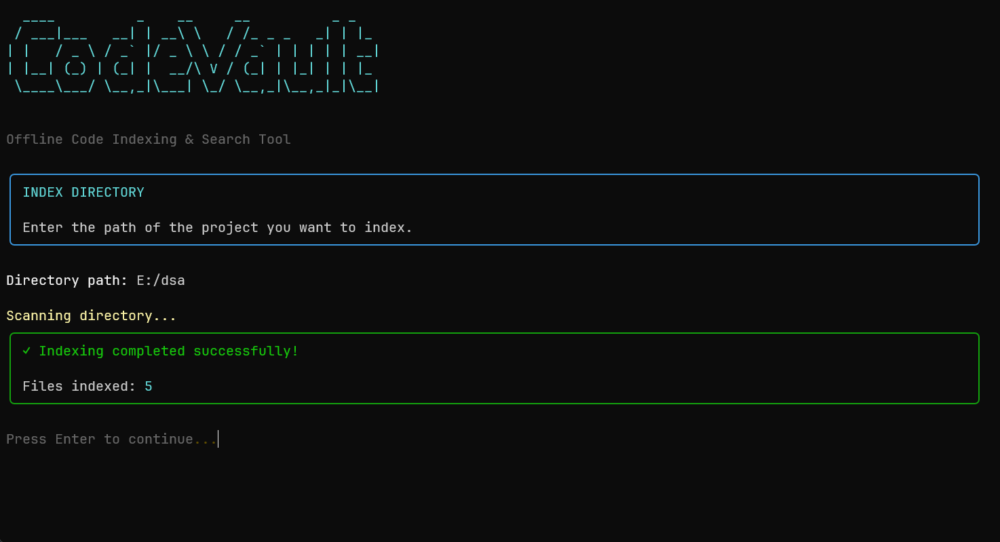
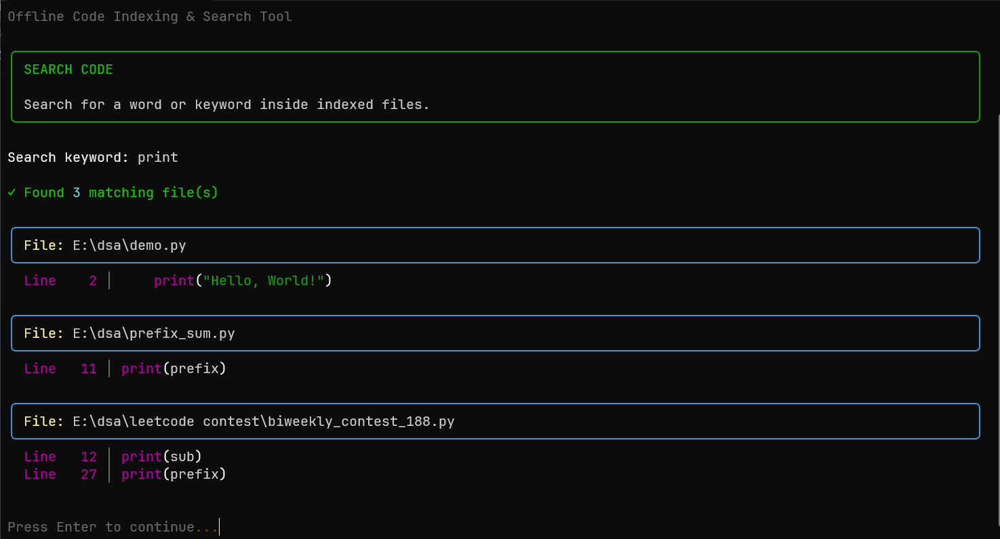

# 🔐 CodeVault

> **Offline Code Indexing & Search Tool**

CodeVault is a lightweight command-line tool that allows developers to **scan, index, and search source code from local projects**.

Instead of manually opening multiple files to find a particular function, keyword, or piece of code, CodeVault creates a local SQLite index and lets you search through your indexed code directly from the terminal.

---

## ✨ Features

- 📂 Recursively scan project directories
- 🔎 Search code using keywords
- 🗃️ Store indexed code locally using SQLite
- 🔄 Automatically rebuild the index when indexing a directory
- 🚫 Ignore unnecessary directories such as `__pycache__`, `.git`, and `node_modules`
- 🎨 Colorful and clean terminal interface
- 🖥️ Cross-platform terminal clearing
- ⚡ Lightweight and completely offline
- 🐍 Built with Python
- 🔒 Source code stays on your local machine

---

## 🖥️ Screenshots

### Main Menu



### Indexing a Project



### Searching Code



---

### 1. Clone the Repository

```bash
git clone https://github.com/Digvijay010606/CodeVault.git
```

### 2. Enter the Project Directory

```bash
cd CodeVault
```

### 5. Install Dependencies

```bash
pip install -r requirements.txt
```

### 6. Run CodeVault

```bash
python main.py
```


---

# 🛠️ Tech Stack

- **Python**
- **SQLite3**
- **Rich** – Terminal UI, colors and panels
- **PyFiglet** – ASCII graphical title
- **Pathlib** – File and directory handling

---

# 📁 Project Structure

```text
CodeVault/
│
├── main.py
├── scanner.py
├── indexer.py
├── database.py
├── config.py
│
├── screenshots/
│   ├── main-menu.png
│   ├── indexing.png
│   └── search.png
│
├── data/
│   └── codevault.db
│
├── requirements.txt
├── README.md
└── .gitignore